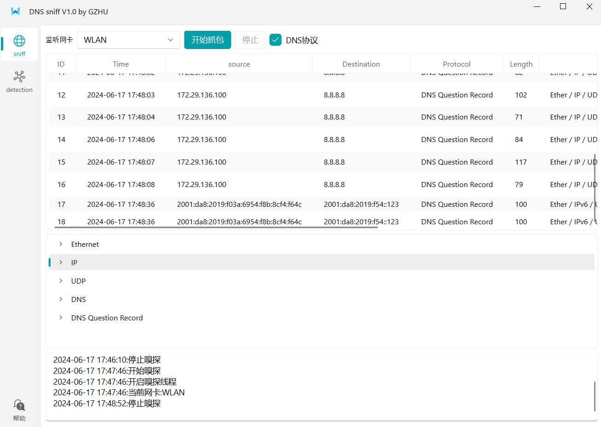
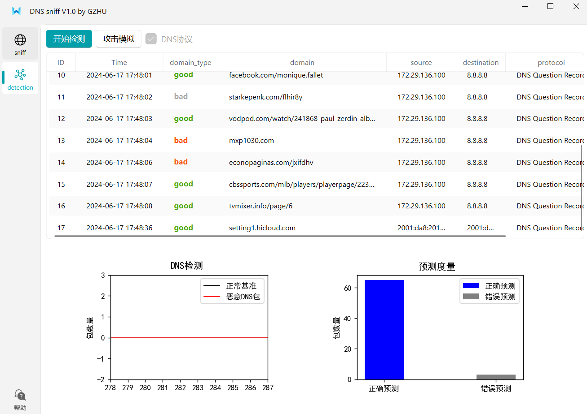

# DNS sniff and detection
## author infomation
 **github** :rightstar2020

 **university**: Ghuangzhong University

 **time**: 2024.06.01
## description
 This project is a DNS sniffing and detection tool. It can be used to monitor DNS traffic and use some mechine learning models to detect malicious DNS traffic(detect by malicious domain in the dns query packet).Better methods todo...

 这是一个DNS嗅探和检测工具。它可以用于监控DNS流量和检测恶意DNS流量（通过恶意域名查询检测）。目前使用skylearn框架以及恶意域名数据集(在kaggle上随便找的)训练模型(逻辑回归、朴素贝叶斯、other todo...)，使用训练好的模型对scapy嗅探到的DNS数据包域名查询字段(qname)的域名进行检测。

 机器学习模型其实只是用来做简单的规则匹配，准确性取决于数据集涵盖的恶意和良性域名的数量(数据集之外的基本检测不到)。至于更好的办法todo...

 使用数据集里面的域名构造DNS数据包进行流量重放.

 ## Usage
 select the DNS packet sniff in sniff module and start it before detection.

 使用detection时请先在sniff模块勾选DNS流量进行嗅探，detection模块才可捕获到流量.

 安装依赖:
 ```shell
 pip install -r requirement
 ```
 安装QfluentWidgets UI库
 ```shell
 pip install "PyQt-Fluent-Widgets[full]"
 ```
 启动GUI
 ```shell
 python ./gui/mainWindow.py
 ```
 ## GUI interface


